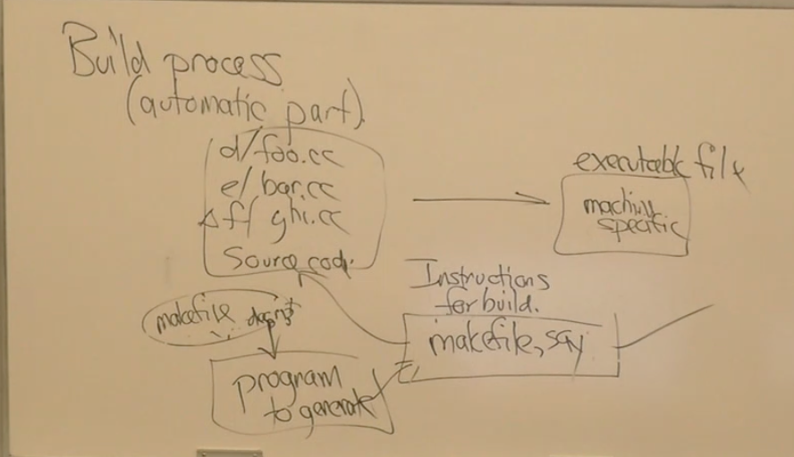

# CS 35L Notes

## Table of Contents
- [Course Overview](#course-overview)
- [Lecture 1: Unix Command Line](#lecture-1-unix-command-line)
- [Lecture 2: Emacs and Processes](#lecture-2-emacs-and-processes)
- [Lecture 3: Operating Systems and Shell Scripting](#lecture-3-operating-systems-and-shell-scripting)
- [Lecture 4: Lisp and Python](#lecture-4-lisp-and-python)
- [Lecture 5: Python](#lecture-5-python)
- [Lecture 6: More Python](#lecture-6-more-python)
- [Lecture 7: Network Architecture and Protocols](#lecture-7-network-architecture-and-protocols)
- [Lecture 8: HTTP, HTML, CSS](#lecture-8-httphtmlcss)
- [Lecture 9: JavaScript and Shit](#lecture-9-javascript-and-shit)

## Course Overview
Case studies in software construction:
- File systems (POSIX, Linux, macOS)
- Scripting (sh, Python, Emacs, Lisp, Javascript)
- Building and construction (make, packaging, installing, configuration)
- Version control
- Low-level debugging
- Client-server architecture

Principles behind software construction:
- Algorithms / data structure (CS 31, 32)
    - Programming
    - Data design
- Integration
- Configuration
- Testing
- Versioning (connected to configuration, not the same thing)
- Forensics

CS 35L exams:
- Open book
- Detailed questions about the homework

## Lecture 1: Unix Command Line

### Shell Prompts
- `$`: Shell prompt 
- `$ ps -ef`: Display **e**very **p**rocess **s**tatus with **f**ull details
    - Default: some processes
- `$ ps -ef | less`: Display process status interactively using the `less` program.
    - Application called `ps`, application called `less`
    - `less`: A program that will take data from `ps` and display it interactively on your screen so you can type characters at it and shows results
    - Both programs are running parallel, `ps` is outputting but is frozen because it's waiting for `less` to read it
    - Return: Scroll down
    - Arrow key: Scroll up
    - `/`: Search for specific terms

### Subshell
- `$ sudo sh`: Run the following command as root
- `$ rm -fr /`: Remove everything under the root directory recursively
    - `rm`: Remove
    - `/`: Root directory
    - `-f`: Remove everything
    - `r`: Recursive
- `$ ^D`: CTRL + D, informs the shell that there is no more input to be read
    - End of file

### Some More Commands
- `$ top`: Display processes in descending order of CPU usage
- `$ printf`: Classic print function
- `$ sort -r`: Sort in reverse order
- `$ fmt`: Format text in paragraph style
- `$ man`: Access manual sections for commands

### Command Combinations
- `A | B`: Run two commands in parallel, using the output of the first as input for the second
- `A ; B`: Execute A, wait for it to finish, then execute B
    - Equivalent to `A \n B`
- `A & B`: Run A and B in parallel without linking their outputs.

## Lecture 2: Emacs and Processes

### Emacs
- `emacs`: Opens Emacs in its full graphical mode with a GUI
- `emacs -nw`: Open Emacs editor without a GUI
- Each process has standard input (stdin, 0), standard output (stdout, 1), and standard error (stderr, 2)
- `RET`: Return/Enter key
- `^X ^C` / `C-x C-c`: Exit
- `M-x shell RET`: Run a subshell interactively
- `^X ^F` / `C-x C-f`: Look at files
- `^X ^F filename RET`: Open a file
- `^S pattern RET`: Search for a pattern incrementally

### ASCII
- On top is control characters (0x1f to 0x7f, 32 of them)
- 95 ordinary characters
- 1 extra control character (delete)
- Meta characters

### REGEX
- `$ grep 'RE' file_1 file_2...`: Search for lines matching the pattern in specified files and print it down    
    - Quotes are for the shell
- Regular expressions are patterns that match themselves
- `PQ`: Match anything that can be expressed as st
    - P matches s
    - Q matches t
- `^P`: Match at the start of the line
- `P$`: Match at the end of the line
- `.`: Match any single character, except the newline character
- `P*`: Match zero or more instances of P
- `\(P\)`: Same as P
- `\\`: \
- `\< \>`: Start and end of the word
    - `\<`: Start of a word; the character immediately following it must be the beginning of a word
    - `\>`: End of a word; the character immediately preceding it must be the end of a word
    - `\<word\>` would match the word "word" only when it appears as a whole word, not as part of another word
- `abc*d`: Matches strings where "ab" is followed by zero or more occurrences of the character "c," followed by the character "d" 
    - This pattern would match strings like "abd," "abcd," "abccd," and so on.
- `a\(bc\)*d`: Matches strings where "ab" is followed by zero or more occurrences of the sequence "bc," and finally followed by the character "d" 
    - The `\(` and `\)` are used for grouping in regular expressions, and the * applies to the entire grouped expression
    - This pattern would match strings like "ad," "abcd," "abcbcd," "abcbcbcd," and so on
- `$ grep -E`: Extended regular expression
    - -E vs default:
    - `(ab)` vs `\(ab\)`
    - `(ab?)*` vs `\(ab\?\)*`
    - `q(ab/c)*r` vs `q\(ab\/c\)*r`
- `$ grep -F '___'`: Match fixed strings only
- `$ grep -P 'complicated'`: Slower, Perl-compatible regex

### Shell
- Shell has special characters: `* $ \ | & ‘ “ ( ) ; = [ ] (space)`
- Displays abc on the screen:
```
x = abc
echo $x
``` 
- `cat $x`: This command will substitute the value of the variable $x into the command
    - If the variable $x is set to "file.txt," then the command becomes cat file.txt
- `cat ‘$x’`: In this command, the use of single quotes means that the shell will treat everything between the single quotes as a literal string
    - The command will literally attempt to open a file named $x, including the dollar sign as part of the filename
- Three kinds of quoting:
    - Single quotes (`'`) for no apostrophes in the middle
        - `cat ‘3 o’ \' ‘clock.txt’`
            - Single quotes around 3 o and clock.txt
            - `\'` is for the apostrophe after o
            - Basically asking to cat '3 o' clock.txt'
        - `cat ‘3 o’ \' clock.txt`
            - No apostrophes around clock.txt
    - Backslash (`\ any character`) for representing a character
        - If you have a file named `file\names.txt`, and you want to refer to it literally, you would use `file\\names.txt` or enclose the entire name in single quotes: 'file\names.txt'
    - Double quotes (`"`) for more complex cases

### Patterns
- P+: One or more Ps ab+c 
- P+ = `(P|PP|PPP|…)`
- P+ = `PP*`
- `(A|B)C` = `AC|BC`
- `{abc*d}{3}`: Matches exactly three occurrences of the subpattern `abc*d`, where '*' represents zero or more occurrences of the character 'c'
    - Example: "abcdcd," "abccd," repeated three times
- `P{3}` = `PPP`
- `P{1,5}` = `P|PP|PPP|PPPP|PPPPP`

### Bracket Expressions
- `[abz]`: Matches a single character (a, b, or z)
    - Equivalent to `(a|b|z)`
- `[^abz]`: Matches any character not a, b, or z
- `[a-z]`: Matches any character that's not an ASCII letter
- `[0-9]`: Matches any digit between 0-9
    - Equivalent to `[0123456789]`
    - Case sensitive
- `[()*]`: These are not special characters inside brackets
- `[^]-]`: Matches anything that isn't `^`, `-`, or `]`
- `[aaab]` == [ab]
- `[[:alpha:]]`: Matches any single alphabetical character in the ASCII character set
- `[[:alpha:]$/]`: Matches any single character that is either an alphabetical character, dollar sign, or slash
- `[[:ascii:]]`: Matches any single ASCII character

### Little Languages
- REs are a little language
- Shell is a little language for controlling how programs run
- Interactive shell vs scripts
    - Reads commands and executes them
    - Interactive: reading commands from standard input
    - Script: reading commands from a file
- If you want a shell script to work, the first line of the file should start with `#!/bin/sh` and the file should be executable

### Some More Commands
- `ls -l`: List all the files in the current directory
- `d`: Directory
- `-`: Regular file

### Permissions and chmod
- Permissions of POSIX files are typically expressed as a 12-bit number represented in octal (base-8) notation

- `chmod`: Change file mode
    - `chmod 7 simple`: Grant read, write, and execute permissions to the owner of the file or directory
    - `chmod 0 simple`: No one has permission to read
    - `ls -l simple`: List detailed information about the file or directory
    - `chmod 644 file` or `chmod u=rw,g=r,o=r file`: Symbolic mode

## Lecture 3: Operating Systems and Shell Scripting

### Standards
- International standard for C++ 
  - Specifies language features and behavior for C++.
  - Facilitates consistency in C++ implementation across different platforms.
- Little languages have shorter specs
  - Designed for specific tasks, making them efficient and easy to implement
- POSIX (Portable Operating System Interface) standards ensure compatibility across REs, shell, file system 

### File
- Collection of data that sits in secondary storage
- Data is persistent; even if the computer crashes it'll still be there
- Survives outages and crashes
- Memory is more persistent at the cost of being more expensive or slower (usually slower)

### POSIX
- Specification defining the organization of directories (maps file name components to files) and regular files (most common sort of file), not an implementation
- Each regular file is a byte sequence
- Special directories like `.` (current directory) and `..` (parent directory)
- File system rules:
    - There are limits to how many files you can put in the file system
    - The file system is organized as a tree of directories
        - Directories map names to other files, files just contain content
        - Top of the tree is called root directory
    - Hard links
        - The same file can have different names in different directories
        - Lets you share files very cheaply 
        - Second column (?) is the number of hard links to that file
    - Symbolic links
        - Symbolic links can live anywhere a regular file can; think of it as containing a sequence of bytes, just like regular files do
        - You can create a symbolic link to a file that doesn’t exist yet
            - When it does exist the symbolic link will start working
    - Symbolic links can point to directories, hard links cannot
    - You can have hard links link to symbolic links
- If you don’t have write permission to a file, but you have permission on the current directory, you can still rm the file

### File Name Interpretation
- Starts from the beginning and looks up the file name components
- File name components are anything that's not a slash
- `foo/bar/bar`
    - Looks for `foo` in the current directory 
- Extra slashes (two or more slashes in the middle of a file name) are ignored
- If the file name starts with a slash, it's interpreted the same except you start at the root directory
- `foo/bar/baz`
    - If `bar` is a symbolic link, substitute `bar` with the content it points to, and reinterpret the file name when you evaluate the file name
    - `foo/abc/baz`

### Other
- Some commands including `ls` know if a file is a symbolic link while others like `cat` and `cd` do not
    - “Too many levels of symbolic links”: if there’s a loop or something
- `c`: Character special files
    - A type of special file that provides unbuffered access to devices
    - Data is transferred directly between the device and the application without any intermediate buffering
- `b`: Block special files
    - A type of special file that provides buffered access to devices
- `/dev/full`: Ran out of space
- `/dev/null`: Discard data written to it 

### Shell 
- A scripting/programming language
- `A | B`, `A & B`, `A || B`: Succeeds if A or B succeeds
- `A && B`: Succeeds only if they both succeed
- Commands
    - `cat`
    - `echo`
    - `test`
    - `[`
- Switch statements
    - `case (string) in *.c)`
    - `esac`
    - `?` matches exactly one character
    - `*` matches any character
    - The first case matches win, the other cases are not executed
    - Globbing patterns
        - Enables flexible and concise file matching
        - `*`
        - `?`
        - `[a-z]`
- `for` loops
```
for v in *.c *.h qrs
do
    cat $v
done
```
```
for v in *.c *.h qrs; do
    cat $v
done
```
- Variables
    - `$1/$2`: The first/second arguments to your shell script
        - Represents positional parameters that capture values provided after the script name
    - `$?`: Exit status of the last executed command
        - 0: success
        - Non-zero: failure
    - `$#`: Number of arguments
    - `${var-default}`: Expands to the value of the variable `var`
        - If `var` is not set or is null, it provides a default value only for expansion purposes and does not modify the variable itself
    - `${var=default}`: Similar to `${var-default}`, but if `var` is not set or is null, it provides a default value and assigns that default value to `var`
    - `${var+set}`: Expands to the value of `var` only if `var` is set (even if it is set to null)
        - If `var` is not set, the expression expands to an empty string.
    - `${var?}`: Causes the script to exit if `var` is not set
        - Displays an error message containing `var` if `var` is not set and terminates the script
    - `$`: Represents the process ID (PID) of the currently running shell
        - Uniquely identifies the instance of the shell.
    - `!`: In certain contexts, it is used for negation in shell scripts
    - `PATH`: Stores a colon-separated list of directories in which the shell looks for executable files
        - Each directory listed in `PATH` is searched sequentially when a command is entered
    - `PWD`: Represents the present working directory
        - Holds the full path of the current directory.
    - `HOME`: Stores the home directory of the current user
        - Provides the full path to the user's home directory, usually `/home/username` on Unix-like systems
```
var = ‘qrs t’
echo $var
```

### GREP
- Global Regular Expression Print
- Used for searching text patterns within files
- `set | grep PATH`: Displays environment variables that contain the string "PATH"
    - `set`: Displays all shell variables and their values, including environment variables
- `~:` Tilde expansion
    - Tilde expansion with a username can also be used to represent the home directory of a specific user
    - `cd ~eggert` would take you to the home directory of the user named "eggert"
- `$( ccc )`: Command substitution
    - Allows the output of a command or series of commands to be used as part of another command
    - The command(s) within the parentheses (ccc) is executed, and its output is substituted in place
    - If `ccc` is a command that prints a value, `echo "The result is $( ccc )"` would incorporate the output of ccc into the echo command
- `$((2+2))`: Arithmetic expansion
    - Allows for the evaluation of mathematical expressions within double parentheses
    - In the syntax `$((2+2))`, the expression 2+2 is evaluated, and the result (in this case, 4) is substituted in place

### Command Line Operations
- `ls -al`: Lists detailed information (permissions, owner, group, size, modification time, name of each file/directory) about all files and directories in the current directory, including hidden files
- `ln foo bar`: Creates a hard link named "bar" that points to the same file as the original file "foo"
- `rm file`: Removes the directory entry for the specified file
    - If the file is a regular file, it is deleted
    - If it's a symbolic link, only the link is removed
- `(echo aaaa>foo)& (echo bbbb>foo)`: This demonstrates a race condition where two commands are trying to write to the same file ("foo") simultaneously
    - The outcome depends on which command completes first
- `!!`: Repeats the last command entered in the shell
- `!*`: Repeats the arguments of the last command
    - Useful for quickly reusing the arguments without retyping them
- `cp <file> <file2>`: Copies the contents of "file" to a new file named "file2," creating a duplicate
    - Both files are independent of each other after the copy.
-`ls -i`: Lists the files in the current directory along with their respective inode numbers
    - Inodes are unique identifiers within the filesystem
    - It helps identify hard links; if two files have the same inode, they are hard links
- `mv a b`: Removes the directory entry for "a" and creates a new entry for "b"
- `running inside parentheses`: *Commands within parentheses are executed in a subshell, meaning they run in a separate environment
    - Changes made within the subshell do not affect the parent shell
- `sleep`: Delays the execution of subsequent commands for a specified amount of time
- `ln -s <file> <file2>`: Creates a symbolic link named "file2" that points to the original file "file"
- `echo $?:` Prints the exit status of the last executed command
    - A status of 0 indicates success, while a non-zero status indicates an error or failure
- `case`: A shell construct used for conditional branching
    - Allows matching a string against multiple patterns and executing corresponding code blocks

## Lecture 4: Lisp and Python

### Field
- Field splitting: After expansion and substitution, Emacs looks for spaces in your command to tell where a command starts and stops
- Field separators
    - By default `(space)`, `\t`, `\n`
    - Example: `cat a b`
    - `IFS = :`

### Pathname Expansion
- `* ? []`
- `*`: Matches any sequence of characters
- `?`: Matches exactly one character
- `v=*.c; cat $v`: Assigns the list of filenames matching the pattern *.c to the variable v and uses `cat $v` to concatenate and display the contents of all files represented by the variable v
- `echo qrs?.c`: Prints out `qrs?.c` when you do not have any file that matches the pattern in the current directory 
- `echo "$IFS" | od -t c`: Prints the Internal Field Separator ($IFS) to the standard output
  - `od`: Converts input into Octal format
  - `-t c`: For character representation

### Redirection
- `>a, 1>a`: Redirects standard output to a
- `<b, 0<b`: Redirects standard input to b
- `<’b c’x`: Looks for a file called `‘b c’x`
- Can do any number of times of redirection
  - Example: `echo foo >a >b`
  - `a` is empty, output is in `b`
- `2>c`: Redirects standard error
- `2<>d`: Reads and writes from d
- `cmd >x 2>&1`: Redirects 2 to wherever 1 is redirected to
    - `0<&3`: Duplicates 3 into 0
- `cmd >x 2>&-`: Closes the output of standard error
- `cmd >x 2>/dev/null`: Sends standard error into `/dev/null`
- `(a 2>&3 <f|b) >o 2>o 3>&1`
    - 0 1 2 are standard
    - File descriptors 3-9 are up to the user
    - `|` is lower priority than `< >`
- `<&- `: Closes stdin

```
if a|b|c; then
    echo ok
fi
```
- The exit status of a pipeline is the exit status of the last command
- `exit`: Exits
    - Not executed by a command
    - Built-in command of the shell
    - Other built-n commands: `cd`, `break`, `continue`, `return`
- Shell functions vs. Shell scripts
    - Lighter weight
    - Heavier weight but more independence
- `if (a; echo $?>x) | b; then`
    - Executes the command group `(a; echo $?>x)` in a subshell
    - `echo $?>x` prints the exit status of the previous command (command a) to a file named x
    - Pipes the output of the entire command group to another command b
    - If the exit status of command a is successful (zero), the command following then (in this case, b) will be executed

### Emacs Lisp
- 90% of emacs source code is written in Elisp instead of C
- Scripting language
    - More generous and flexible
    - Less reliability and safety, easier to screw up without gcc checking all the errors before running the code
- Read Eval Print Loop (REPL)
- `C-x b NAME RET`: Switch to buffer
  - `Buffer *scratch*`
    - You don’t mind the content in the scratch buffer going away when exiting
    - Different key bindings inside the scratch buffer
  - `(+ 2 2) C-j`
    - Print 4
    - A different way to execute functions in emacs than in C++
  - `(sqrt (* 37 48))`
  - `(defun sqr (a) (* a a)) C-j`: Define a function in this particular instance of emacs; once you quit emacs it’s gone
- `C-h b`: List all key bindings
- `C-t`: Transpose

### Terminology
- File: Persistent storage in a file system, contains a sequence of bytes
- Buffer: Is like a file, but is sitting in emacs as RAM, not persistent
- Window: A view of a buffer, typically part of a buffer
- Frame: A window in macOS

### Examples
```
(defun switch-to-other-buffer()
  (interactive)
  (switch-to-buffer((other-buffer)))
```
- `other-buffer`: Returns the most recent selected buffer other than the buffer you're currently in
- `C-h f`: Tells what a command does
- `M-:`: Quick, one-off evaluations
- `global-set-key`: Specifies a key stroke and what you want that key stroke to do
  - `(global-set-key(kbd “C-t”) ‘switch-to-other-buffer)`
  - The single quote before `switch-to-other-buffer` and not after means “don’t call the function, we're just using its name”
- `M-x load-file`: Save the emacs lisp file

### Python3
```python
line = 'GOOG, 100, 141, 70'
types = [str, int, float]
fields = [ty(val) for ty, val in zip(types, line.split(','))]
zip(types, x)
```

## Lecture 5: Python

### History and Motivation
- Little languages: `sh`, `sed`, `ank`, `grep` 
- Perl: “There’s more than one way to do it”
```
if (x) f();
f() if (x);
```
- BASICS (1960s): Bad, but used a lot
- ABC
    - "As simple as ABC"
    - “There’s one good way to do it”
    - Indentation is part of the language
    - High level data structure
    - Scripting language, no type checking by compiler
- Redo ABC and Perl
```
if a == 0
(tab) b = 5
(8 spaces) c = 6
```

### Numbers
- Integers: Supports multiple precision arithmetic, allowing computation with larger numbers (though slower)
- `INTMAX + 1` gives `INTMIN` in C++
- Floats: Works just like floats in C++
- Complex numbers: 1 + 2J

### Strings Syntax
- Single quotes: ‘abc def’
- Double quotes: “abc def”
- Triple quotes (works throughout different lines): ‘’’abc def ghi jk’’’ or “””abc def ghi jk”””
- `r'abc'`: Treats backslashes as literal characters and doesn't interpret them as escape characters
    - `r'abc'` is equivalent to the string `'abc'`
- `r'a\b\\c'`: Another raw string literal where backslashes are treated as literal characters
    - Equal This string would be 'a\\b\\\\c'.
- `'the %d answer is %g' % (35, -12.7)`: %d and %g are placeholders that will be replaced by the values (35, -12.7) in the string
    - `%d` is a placeholder for an integer
    - `%g` is a placeholder for a float
    - The resulting string would be 'the 35 answer is -12.7'
- `r’abc’` CHECK LATER
- `r’a\b\\c’`
```
x = a + b + \
    c + d
x = (a + b + c + d)
```

### Object Identity and Types
- o = …
- Python values are all objects, each with:
    - Identity
        - id(o)
        - Doesn't change
    - Type
        - type(o)
    - Value
        - Can change, if the object is mutable
- Objects have attributes and methods
- `o.a`: If you have the value o and want to know attribute a
    - `o.m(27)`: Invoke method m with argument 27
- o is p if o and p are the same object / same identity 
    - id(o) == id(p)
- o == p doesn’t compare identity, but values

### Builtin Types
- `none`: null pointer
- number: `int`, `float`, `complex`
- `boolean`
- `sequences`: `string`, `buffer`, `list` (mutable sequence of anything), `tuple` (immutable sequence of anything)
- `mappings`
    - `dict` (hashtable)
    - Indexes are whatever objects you like

### Sequence Operations
- `s[i]`: Indexing
    - 0 <= i < len(s)
    - `s[-1] = s[len(s) - 1]`
- `s[i:j]`: Slicing
    - i is inclusive, j is exclusive
    - `s[i:] = s[i:len(s)]`
    - `s[:j] = s[0:j]`
    - `s[10:5]` gives an error
    - `s[10:10]` is ok
- `len(s)`: Sequence length
- `list(s)`: Convert an iterable (such as a string, tuple, or dictionary) into a list
    - `list("hello") = ['h', 'e', 'l', 'l', 'o']`
- `min(s)`: Minimum
- `max(s)`: Maximum
- Mutable
    - `s[i] = v`
    -` s[i:j] = s1`
    - `s[3] = ‘abc’`
    - `s[i:i] = v`
```
r = s[i]; 
del s[c];
return r
```

### List Operations
- `s.append(v)`: Appends a single value v to the end of the list s
    - Average time complexity of O(1) in an amortized sense
    - Efficient for adding elements to the end of the list
- `s.extend(s1)`: Extends the list s by appending all elements from another iterable s1 to the end of the list
    - Essentially combines the elements of two lists
- `s.count(v)`: Returns the number of occurrences of value v in the list s
- `s.index(v)`: Returns the index of the first occurrence of value v in the list s
    - If the element is not found, it raises a ValueError
-` s.insert(i, v)`: Inserts the value v at the specified index i in the list s
    - Elements to the right of this index are shifted to make room for the new element
- `s.pop(i)`: Removes and returns the element at the specified index i from the list s
    - If no index is provided, it removes and returns the last element
    - This method can be used to implement a stack
- `s.pop()`: Removes and returns the last element from the list s
    - This is equivalent to popping the top element from a stack
- `s.reverse()`: Reverses the order of elements in the list s in-place
- `s.sort()`: Sorts the elements of the list s in ascending order
    - If the elements are not comparable, it raises a TypeError
    - Modifies the list in-place

### String Operations
- `s.join(t)`: Join strings in t, using s as a separator
    - `‘;’.join([‘abc’, ‘xy’, ‘z’]) = ‘abc;xy;z’`
- `s.replace(old, new, [,maxreplace])`
    - `‘abracadabra’.replace(‘ab’, ‘xy’, 1) = ‘xyracadabra’`

### Dictionary Operations
- `d = {'abc': 19, 'def': 27.6}`: Creates a dictionary d with keys 'abc' and 'def' mapped to the values 19 and 27.6, respectively
- `d['abc']`: Retrieves the value associated with the key 'abc' in the dictionary d (19)
- `d['abc'] = 'xyz'`: Updates the value associated with the key 'abc' to 'xyz'
    - Dictionaries in Python can have values of different types
-` d[19] = d`: Associates the key 19 with the entire dictionary d as its value
    - Keys in a dictionary can be of various types.
- `len(d`): Returns the number of key-value pairs in the dictionary d (2)
- `d.clear()`: Removes all key-value pairs from the dictionary d, leaving it empty
- `d.copy()`: Returns a shallow copy of the dictionary d
    - The copy is a new dictionary with the same key-value pairs but is a different object in memory
- `d.has_key(k)`: Checks if the key k is present in the dictionary d
    - Nuked in Python 3
- `d.get(k[,v])`: Returns the value associated with the key k if it exists in the dictionary d
    - If the key is not found, it returns the default value v (optional)
    - This method is useful to avoid throwing an exception if the key is not present
    - `d[k]` can throw an exception; this won't
- `d.get('abc', -1)`: Retrieves the value associated with the key 'abc' in the dictionary d
    - If the key is not found, it returns -1 as the default value
- `d.keys()`: Returns a view object that displays a list of all the keys in the dictionary d
- `d.values()`: Returns a view object that displays a list of all the values in the dictionary d
- `d.items()`: Returns a view object that displays a list of key-value tuple pairs in the dictionary d
- `d.popitem()`: Removes and returns a key-value pair as a tuple from the dictionary d
    - The pair returned is arbitrary, as dictionaries are unordered

### Function Value
```
f = lambda x,y: x+y

def f(x,y):
	return x+y

f(3,4)

// same functions
```

## Lecture 6: More Python

### Functions
- Python callable types: functions
- Optional arguments
    - More functions: `def printf(format, *args )`
        - `*args`: Takes one or more arguments; when called, it's set to a tuple containing the trailing arguments (a tuple of remaining arguments)
        - `args[3]`: Gives you the 4th trailing argument; assumes it has that many arguments
        - `len(args)`: Returns the number of trailing arguments
- Named arguments
    - In the case where you can't remember what order the arguments are in
```python
def arctan(y, x);

# Can call
arctan(x=3, y=0.5)

printf('%d = %g', 37, 0.9)
print(format % args)

def f(a, b, **c):
    # The caller will specify named arguments
    # If they don't name any of the actual parameters, collect them as a dictionary and pass that dictionary to the callee 
    # c['y']: Looks up the 'y'th member of the dictionary
    # len(c): Tells you how many arguments are in the dictionary

f(19, 'abc', x=9, y=27)
```
- Tuple with one item: `b = ('abc',)`
- Creating a list
```python
create_list(5, -1, 'ab', x)

def create_list(*x):
    return list(x)
```

### Classes
```python
class c(a, b):
    def m(self, o, *y):
        # a and b are super classes
```
- `d = c`: d and c refer to the same class, as a class is just an object
- `o = c()`: Creates an instance o of the class c
    - `()` indicates the invocation of the class constructor
    - o is an object based on the class c, and you can use its methods and access its attributes
- `o.m(5, 19, 12)`: Calls the method m of the object o
    - The method m is defined inside the class c
    - Takes four arguments: self (implicitly passed, representing the instance o) and the other three

- A class is an object
- `__dict__`: Contains the class's names as a dictionary
- `c.__dict__['m']`: Gives you method 'm' in the class 'c'
- `c.__dict__.keys()`: Finds all the names in the class dictionary and gives the keys; yields `{'m', '__name__'}`
- Underscore underscore is for names that are built into the interpretor 

```python
class c(a):
    def __init__(self, x, y):

# Can call it with c(5, 10)
```
- `def __del__(self)`: Destructor
- `def __repr__(self)`: Returns a string representing the object (serializer)
- `def __str__(self)`: String representation of the object (informal summary)
- `def __cmp__(self, other)`: Compares one object to another object
    - Compare <, returns negative number
    - Compare =, returns zero
    - Compare >, return psotive number
- `def __hash__(self)`: Returns a hash value (int) based on the contents of your object
- `def __add__(self, other)`: How addition works
    - `a + b` = `a.__add__(b)`

```python
o = c(37, %)
p = f(o)
if p:

# Looks at any objects and sees if it's true or not
# 0 values count as false (including empty strings)
```

### Emacs Modes
- Emacs is modeful; its behavior depends on mode
- `C-h m`: Gives help about the current mode
- `C-c C-p`: Python interpreter; use Python as a desk calculator
    - To be able to run this command, first edit Python source code
- `M-x text-mode`: Text mode, treats files as plain text

### Build Process (Automatic Part)


- Main advantage of a makefile over a shell script is incremental builds
    - Skips steps that have already been done, making it faster
    - Knows what steps have already been done by looking at timestamps
- Simpler builds with scripting languages 
- Original goal of Python: simplify the job of building, shipping, and importing software 
- If you have `foo.py` and/or `bar.py`, you could ship it off to the user and let the user see the source code
    - `import foo`: Use your stuff without worrying about it

### Modules
- Usually one .py file.
- `import foo`
    - Creates a new namespace (dictionary)
    - Reads and executes `foo.py` contents in the context of this new namespace (avoids namespace pollution)
    - Binds `foo` to this namespace in the namespace of the caller
- Modules come with namespaces
- `modulename.tryingtolookup`: How to look up something in the namespace of a module
- `from foo import f`: Only imports f
- `from foo import *`: Imports everything
    - Two schools of thought: "Dangerous" and "Hey it's just a scripting language, who cares"
- `import foo`: Looks for foo.py
    - Doesn't scale well when dealing with lots of modules from different sources
    - Too many source files in one directory
    - Easy to lose track of them all
    - Module names themselves can collide
    - Avoid with `PYTHONPATH = /a/b; /c/d/e; /f/g`
        - Looks in `/a/b/foo.py`, etc

### Packages
- Collection of Python modules organized in a tree-structured way
- `import k.l.m.foo`: Looks for k/l/m/foo.py
- xyz.py
```python
#!/usr/bin/python3
class c:
    def f(a, b):
        if __name__ == '__main__':
            # Code to run
            # Test code for this module
```
- `chmod +x xyz`: Adds execute permissions to the file xyz
- `$./xyz`: Execute xyz

## Lecture 7: Network Architecture and Protocols

### Network Architecture
- JavaScript to Chrome is similar to Lisp to Emacs in their respective environments
- Client - Server - Network: Simplest Network App
    - Director - Network - Worker Bees
- Peer-to-Peer (P2P): Decentralized network architecture where each node can act both as a client and a server

### Issues in Network Apps
- Performance
    - Throughput: Amount of data per second shipped through the network (bits/s)
        - E.g. Servers can operate in parallel, or even "out of order"
    - Latency: Delay between sending (speed of light) and receiving
        - E.g. Clients can cache
- Correctness
    - Out-of-order: Addressed through serialization
- Correctness of caching
    - Stale caches: Addressed through cache validation

### The Internet
- Before the Internet, circuit switching with reserved wire pairs
    - Guaranteed performance in terms of throughput and latency
- Packet switching
    - No guaranteed performance
    - Better utilization and resilience to disruption
    - Packets have headers (metadata) and payloads (data)
    - Packets are exchanged via protocols
    - Problems
        - Packets can be lost (network congestion)
        - Packets can be received out of order (different rates)
        - Packets can be duplicated (misconfigured routers)
- Internet Protocol Suite
    - Based on layered architecture
    - Lowest layer: Internet Protocol (IP)
        - IPv4 (1983) developed by a team led by J. Postel (UCLA)
        - Connectionless packets with headers containing various information
            - Length
            - Protocol number (for next level up)
            - Source and destination (address)
            - TTL: Time to live (hop count)
            - Checksum (16 bits)
- UDP (User Datagram Protocol)
    - Developed by D. Reed (MIT)
    - Utilizes IP and port numbers for specifying services
        - HTTP -> 80
- TCP (Transmission Control Protocol)
    - Developed by Vint Cerf (UCLA) and Bob Kahn (Princeton)
    - Ensures ordered, reliable, and error-checked data streams
    - Implemented
        - Divide stream into packets
        - Retransmission and reassembly
        - Flow control
    - Protocols built atop TCP: IMAP, POP, SMTP, HTTP, etc
- Security measures: Encryption
    - HTTPS (HTTP + Encryption) for secure data transmission

## Lecture 8: HTTP/HTML/CSS

### HTTP History
- HTTP/1: Very Simple Protocol (1990s)
    - Open connection
    - Request
    - Response
    - Close connection
    - Performance issues
        - Latency: Addressed through caching 
- HTTP/2 (2015)
    - Header compression
    - Server push: Servers can be spontaneous in pushing content to clients
    - Pipelining: Multiple requests can be sent without waiting for responses
    - Multiplexing: Pipelining combined with responses in any order
- HTTP/1 and HTTP/2 are based on TCP, ensuring reliable and ordered transmission via packet sending underneath
- HTTP/3 (2022)
    - HTTP/3 is designed to address latency for real-time applications, recognizing head-of-the-line problems in TCP

### Pipelines
- Browser rendering pipeline (internal software architecture)
    - The rendering pipeline involves the flow of data from the HTTPS connector through various stages:
        - HTML parsing
        - Internal tree representation
        - Pixel graphics
        - Display
    - Data from HTTPS connector (HTML) -> [] (HTML parser) -> [] (internal tree)-> [] (pixels graphics)-> display
- Rendering pipeline optimizations
    - The internal tree representing the web page dynamically grows as more data arrives
    - The browser focuses on the part of the tree estimated for display, affecting the order of execution of JavaScript code
    - Tentative layout is performed
- WWW (Web) = HTTP + SGML (HTML) -> document representation method
    - Publisher-independent
    - Content, not form (paragraph indentation)
        - Content of paragraph
```
<paragraph> now
    (indentation here doesn't matter) is the time... <emph> today </emph>
</paragraph>
```
- SGML (Standard Generalized Markup Language) with a DTD (Document Type Definition) specifies
    - Paragraph
    - Emphasis
    - Grammar
    - "API for SGML dcouments" ???

### HTML
- HTML element (internal node)
- Elements are surrounded by tags
    - `<p> </p>`
    - Close tag can be omitted if it's obvious as to where the omission is, aka if it's a nested element
- `<br/>`: Void elements
    - No children, nothing underneath
- Elements can have attributes and content
    - Note I put that I no longer understand: Subtree info, ("raw text" elements) context is only text
- Normal elements can contain text and elements
- Entities like `&copy;` represent special characters
- Every browser originally supported different HTML variants where the entities or elements differed
    - Different versions of HTML had their own DTDs, defining the rules for constructing a valid document
    - Standard DTDs for HTML
        - 1, 2, 3, 4, 4.1, etc
        - Standardization effort
        - 5 is the evolving standard 
- DOM (Document Object Model)
    - Object-oriented language approach to HTML
    - Offers APIs and classes for interacting with HTML content
    - JavaScript is the most popular
    - Traverse the tree and find out stuff
    - Modify the tree

### CSS
- CSS (Cascading Style Sheets)
- CSS provides a declarative specification for the form
- `<span style= ' '> </span>`
- Styles are inherited from parent nodes
- Styles can come from
    - Author (of webpage) 
    - User (of the browser)
    - Browser (browser default)

## Lecture 9: JavaScript and Shit

### Data and Code
- Data: HTML, DOM
- Code: JavaScript (can be hooked into HTML), JSX
- Harvard Architecture: Data and code is distinctly split
- von Neumann Architecture: Data and code are more freely intertwined (don't quote me on this)
- YAPL (Yet Another Programming Language): Python in C syntax with no classes
    - Object-oriented but not class-oriented

### Miscellaneous Problem Children
- `<script src=‘myscript.js’> </script>`
    - Problem: Latency
- `here is <a href=‘mypage.html’> hello </a>`
    - here is (pretend there's) hello (a box around hello)
- Short circuit latency
    - `<script> alert(“Hello”); </script>`
    - If the script is complicated, it contributes to larger HTML size (website gets big and fat)
    - Problem: Size of HTML
    - Alert can read and write to the DOM for this web page 
- When you create elements in JS it can be laborious
    - Requires one call per element/attribute/text/string
    - Annoying and error prone
    - Create JSX to combat this problem
    - JSX is the von Neumann approach coming back and saying "I want more mixing code and data with abandon in order to make our code easier to read"
```jsx
const language = "en";
const class = "CS 35L";
const asnmnt = 4;
const header = (
  <h1 lang={language}>
    {class} Assignment {n + 1}
  </h1>
);
```
- h1 lang = "en"
    - CS 35L
    - Assignment
    - 5
- Demonstrating a "what you see is what you get" approach

### Sending DOM Trees Over the Internet
- JSON (JavaScript Object Notation)
    - Write down the JavaScript code, if you executed the code you'd get the piece of data
    - Small subset of JavaScript
    ```json
    {"menu": {
        "id": "file",
        "value": "File",
        "popup": {
            "menuitem": [
                {"value": "New", "onclick": "CreateNewDoc()"},
                {"value": "Open", "onclick": "OpenDoc()"},
                {"value": "Close", "onclick": "CloseDoc()"}
            ]
        }
    }}
    ```
- XML
```xml
<menu id="file" value="File">
  <popup>
    <menuitem value="New" onclick="CreateNewDoc()" />
    <menuitem value="Open" onclick="OpenDoc()" />
    <menuitem value="Close" onclick="CloseDoc()" />
  </popup>
</menu>
```
- Node.js
    - JavaScript runtime for asynchronous events
    - Event loop
    ```js
    while(true) {
        e = getNextEvent();
        handleEvent(e);
    }
    ```
    - Program = set of event handlers -> must be fast
    - Single-threaded
- Multi-threaded apps
```
[] [] [] <- threads
p  p  p
   |
   v
shared objects
```
- You can build a webserver with Node (with one of its library sets)
    - Put it in App.js
    - `$ node App.js`
```js
const http = require(‘http’)
const p = ‘127.0.0.1’
const port = 3000
const server = http.createServer(
    (request, response) => {
        response.statusCode=200
        response.setHeader=(‘ContentType’, ‘text/plain’)
        response.end(‘This is just a toy server.\n’)
})

Content-Type: text/plain \n\n

server.listen(port, ip, ()=>{
    console.log(“Server running.’)
})
```
- Node packages
    - `$ npm`: Short for Node Package Manager
        - Manages packages
        - Packages mutate
            - Package version
            - Which are installed
        - Keep track of this / dependencies versions
        - Write down all the calls to npm and pip3, or get software that will do it for you
            - `package.json`
- Python packages
    - `$ pip3`: Tells you whih packages you have working
    - `$ pip3 install numpy`
- Random notes I don't remember
    - `foo.py`
    - `pyc-byte-compiled python`
    - `.c`
    - `.cpp`

### DevOps and Version Control
- Developers => code => machine
- Developers <- DevOps -> Operations staff

- Backups
    - 103zb/year
    - How do you make backups?
        - Inverse of cache
    - To make this efficient and useful, you need a failure model
        - Your flash drive fails (completely or some blocks fail)
        - You delete trash files by mistake
        - An outsider attacker
        - An insider attacker
- AFR (Annualized Failure Rate) for disk drives up to 3%
    - Suppose: 2 copies of everything
    - AFR is now: (0.03)^2 (assumes failures are independent)
- Don't forget recovery
- What do you back up?
    - Contents of files
    - Metadata of files
    - Every change to every file: expensive but complete
    - Just some changes: cheap but incomplete
- `$ ls -l file`: List detailed information about a specific file
```
make-backups

cp a a.bak
cp b b.bak
inconsistent state
```
- Bonus: If you’re configuring your notes system and you’re using `npm`, how do you make backup copies of your configuration?
    - Locate your `npm` configuration (.npmrc in home directory)
    ```
    ls -a ~ | grep .npmrc
    ```
    - Copy the configuration file
    ```
    cp ~/.npmrc ~/.npmrc_backup
    ```
    - Store the backup in a safe location

## Images


